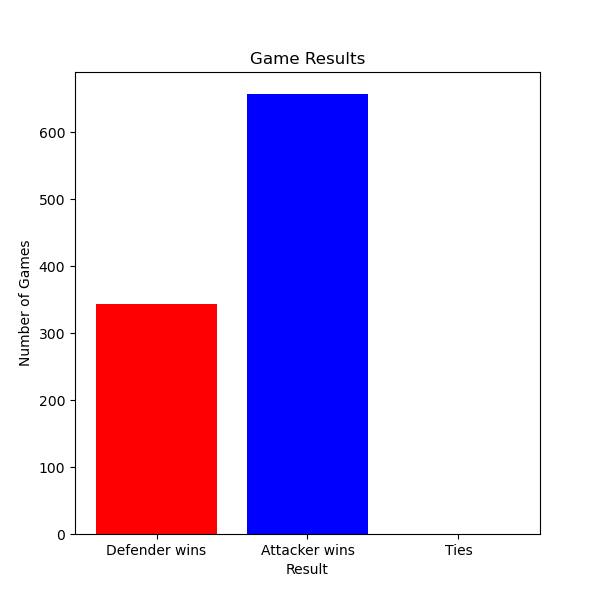

# Adversarial Multi-Agent Reinforcement Learning

This repository is for our Final Project in Network Multi-Agent Systems. It is based on the concept of Q-Learning with 2 implementations. A basic Q-Learning algorithm and a Deep Q Network (DQN) Implementation. In addition to this, we create a custom 10x10 grid environment to train our agent. The Q-Learning algorithm and environment have foundations from the [Reinforcement Learning Series by Sentdex](https://www.youtube.com/watch?v=yMk_XtIEzH8&list=PLQVvvaa0QuDezJFIOU5wDdfy4e9vdnx-7), while for DQN we got our foundational code from ChatGPT. 

## What is unique about this project

In this project we wanted to see how performance would be impacted by decentralized training and execution. In our case we have 3 players, an Attacker, Defender and Target. The Attacker and Defender are agents that are trying to learn an objective. The Target is held constant for training. When we refer to decentralized training and execution we are saying that the Attacker has no knowledge of the defender or the target location aside from the reward function and the Defender has no knowledge of the Attackers or Targets location. In doing so we can create a reward function which is the inverse of the distance to the respective goal. For example as the Attacker approaches the Defender it will get an increasing negative reward and as it approaches the Target it will get an increasingly positive reward.

## Future possible work?

If we wanted to increase our performance for either model we could do centralized training and decentralized execution. We could also give more information to the agent or even learn from a CNN rather than just Dense layers. Lastly, we could do training seperate for the Attacker and Defender, currently they are trained at the same time. 

## What are some results?

Due to the nature of our problem, we expected the results to roughly be 50/50 for if the Attacker wins or loses. However, due to the fact that the Target is stationary the Attacker should win more, this is because the Attacker can learn to go to one location while making an educated expectiontion on avoiding the Defender. While the Defender must learn to predict the Attackers movements. What we see from our results is that we were correct in our assumptions and can see in the figure below shows that the Attacker will win ~65% and lose ~35%. 

  

